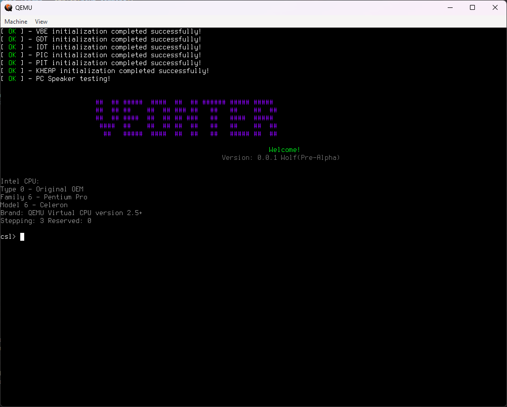
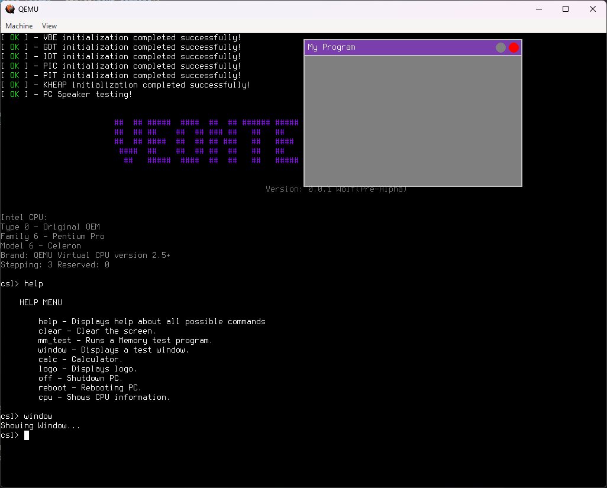

# Veonter Operating System

## Описание
**Veonter** — это 32-битная операционная система, находящаяся на стадии ранней разработки (версия 0.0.1 Wolf Pre-Alpha). Основной целью проекта является создание современной и функциональной ОС с поддержкой широкого спектра возможностей и функций. Несмотря на текущую стадию разработки, Veonter уже включает в себя множество ключевых компонентов и функциональных возможностей, таких как:

- Поддержка VBE (VESA BIOS Extensions)
- Управление динамической памятью (Kheap)
- Страничная организация памяти (Paging)
- Обработка ввода с клавиатуры
- Собственный шрифт
- Консольный интерфейс
- Программируемый интервальный таймер (PIT)
- Программируемый контроллер прерываний (PIC)
- Таблица глобальных дескрипторов (GDT)
- Таблица дескрипторов прерываний (IDT)
- Виртуальная файловая система (VFS) (находится в разработке)
- Обработчики программных прерываний (ISR)
- Обработчики аппаратных прерываний (IRQ)
- Подпрограммы, такие как Калькулятор(calc) и программа для тестов(mm_test)

## Основные возможности
- Консоль с набором команд для взаимодействия с системой
- Возможность отображения графики в графическом режиме

## Скриншоты
Вид после запуска:

Вид во время работы:

## Авторы
Разработка Veonter осуществляется командой **QensyTeam**.

